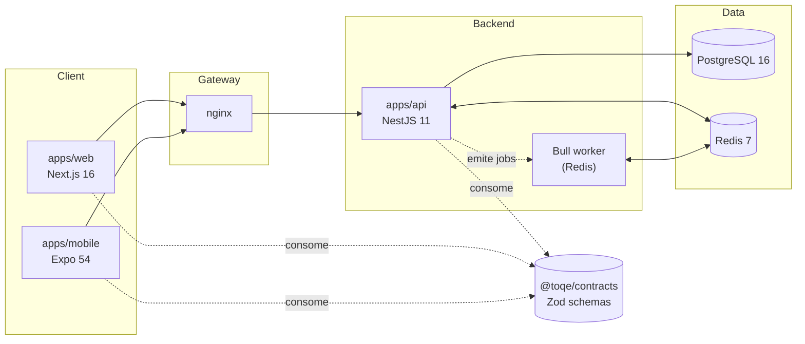

# Arquitetura — Monorepo `toqe`

> Visão geral da arquitetura. Para o plano de reorganização vigente, ver [`docs/10-arquitetura-reorganizacao.md`](./docs/10-arquitetura-reorganizacao.md).

## Visão geral

`toqe` é uma plataforma SaaS multi-tenant para gestão de barbearias (agendamento, agenda, serviços, dashboards, notificações). O monorepo é orquestrado por **Turborepo** sobre **pnpm 9 workspaces**.

## Apps

| Caminho       | Stack                                                                        | Porta dev |
| ------------- | ---------------------------------------------------------------------------- | --------- |
| `apps/api`    | NestJS 11, Prisma 7, Postgres 16, Redis, Bull, JWT (Passport), Pino, Swagger | 3000      |
| `apps/web`    | Next.js 16 (App Router, RSC), React 19, Tailwind 4, shadcn/ui, Framer Motion | 3001      |
| `apps/mobile` | Expo 54, React Native 0.81, Expo Router 6                                    | 19000+    |

## Packages compartilhados

| Caminho                      | Propósito                                                                                                                                              |
| ---------------------------- | ------------------------------------------------------------------------------------------------------------------------------------------------------ |
| `packages/validators`        | Schemas Zod por domínio (auth, usuario, barbearia, agendamento, agenda, notificacao, servico). **Será renomeado para `packages/contracts` na Fase 2.** |
| `packages/shared`            | Tipos, DTOs e enums compartilhados (em construção).                                                                                                    |
| `packages/config`            | Configurações base (env helpers, constants).                                                                                                           |
| `packages/eslint-config`     | Preset ESLint compartilhado.                                                                                                                           |
| `packages/typescript-config` | Preset `tsconfig` compartilhado.                                                                                                                       |

## Padrão arquitetural

### Backend (`apps/api`)

**NestJS modular** — um módulo por feature (`auth`, `usuario`, `barbearia`, `agendamento`, `agenda`, `servico`, `tenant`, `notificacao`, `dashboard`, `relatorio`, `observabilidade`, `prisma`). Cada módulo segue `Controller → Service → (Prisma)`. Multi-tenant via header `x-tenant-id`. Autenticação JWT com refresh-token rotativo. Swagger em `/docs`.

### Frontend (`apps/web`)

Atualmente **layer-based** (`app/`, `components/`, `lib/`, `hooks/`, `contexts/`). **Migrando para feature-based pragmático** na Fase 3, com `src/features/<feat>/{components,hooks,services,schemas,types}` e `src/shared/{ui,api,lib,config,providers,hooks,types}`. Veja a Fase 3 no plano de reorganização.

### Mobile (`apps/mobile`)

Expo Router 6 com camadas espelhando o frontend web. Consumirá `@toqe/contracts` para compartilhar schemas.

## Fluxo de dados

1. Cliente (web/mobile) autentica em `POST /api/v1/auth/login` → recebe `access_token` + `refresh_token`.
2. Requisições subsequentes enviam `Authorization: Bearer <access_token>` + `x-tenant-id: <barbearia>`.
3. `JwtAuthGuard` valida; controllers delegam ao service; service usa Prisma para Postgres.
4. Eventos assíncronos (emails, push) enfileirados em Bull/Redis.
5. Logs estruturados (Pino JSON) → coletor; erros 5xx → filtro Sentry.

## Decisões arquiteturais ativas

- **Zod = source of truth** para validação. Backend usará `nestjs-zod` (Fase 2).
- **TanStack Query** para data fetching no frontend (Fase 3).
- **Design tokens** centralizados em `apps/web/src/shared/ui/tokens.css` (Fase 3).
- **RBAC** via claim `perfil` no JWT, validado em `proxy.ts` (Fase 3).
- **Testes**: Vitest no FE, Jest no BE, Playwright para e2e web, Maestro para mobile, k6 para carga (Fase 6 — pós-reorganização).

## Convenções

- **Commits**: Conventional Commits (`feat`, `fix`, `chore`, `docs`, `refactor`, `test`, `build`, `ci`, `perf`, `style`, `revert`).
- **Branches**: `feature/*`, `arch/*`, `fix/*`, `chore/*`. Ver [`CONTRIBUTING.md`](./CONTRIBUTING.md).
- **Lint/format**: ESLint (flat config) + Prettier, executados via Husky pre-commit (`lint-staged`).

## Observabilidade

- **Logging**: `nestjs-pino` (JSON em prod, pretty em dev).
- **Erros**: filtro Sentry em `apps/api/src/observabilidade/sentry.filter.ts`; SDK Sentry no FE planejado para Fase 3.
- **Health**: endpoints `/health/live` e `/health/ready` planejados para Fase 5 (`@nestjs/terminus`).
- **Tracing**: OpenTelemetry como evolução futura (não na reorganização atual).

## Infraestrutura local

- `docker-compose.yml` — stack completa (nginx, api, postgres, redis).
- `docker-compose.dev.yml` — variante de desenvolvimento.
- Variáveis em `.env.example` na raiz.

## Referências

- [`docs/10-arquitetura-reorganizacao.md`](./docs/10-arquitetura-reorganizacao.md) — plano de reorganização (5 fases).
- [`docs/toqe_plano_estrategico.md`](./docs/toqe_plano_estrategico.md) — plano estratégico de produto.
- [`docs/01-setup-inicial.md`](./docs/01-setup-inicial.md) → `docs/09-sprint-3-*.md` — histórico de evolução.
- [`CONTRIBUTING.md`](./CONTRIBUTING.md) — fluxo de contribuição.
